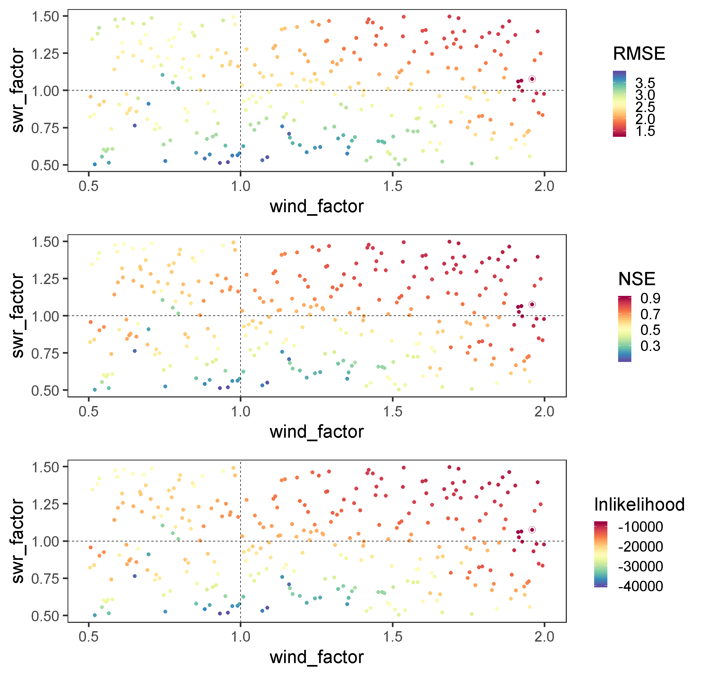

LakeEnsemblR
=====

[](https://travis-ci.org/aemon-j/LakeEnsemblR)   [](https://codecov.io/github/aemon-j/LakeEnsemblR/) [](https://www.repostatus.org/#active)
<a href="url"></a>

Tools for running an ensemble of lake models using standardised input data. Lake models currently incorporated are [Freshwater Lake Model (FLake)](http://www.flake.igb-berlin.de/), [General Lake Model (GLM)](http://aed.see.uwa.edu.au/research/models/GLM/), [General Ocean Turbulence Model (GOTM)](https://gotm.net/) (lake-branch), [Simstrat](https://www.eawag.ch/en/department/surf/projects/simstrat/), and [MyLake](https://github.com/biogeochemistry/MyLake_public).

You can find example setups here: https://github.com/aemon-j/LER_examples.

## Installation

You can install `LakeEnsemblR` from Github with:

```{r gh-installation, eval = FALSE}
# install.packages("devtools")
devtools::install_github("aemon-j/LakeEnsemblR")
```

### Visualize

You can download [PyNcView](http://sourceforge.net/projects/pyncview/), a cross-platform NetCDF viewer, for viewing the NetCDF output.

## Example model run
```{r gh-installation, eval = FALSE}
# Install packages - Ensure all packages are up to date - parallel devlopment ongoing
#install.packages('devtools')
devtools::install_github('GLEON/GLM3r')
devtools::install_github('hdugan/glmtools')
devtools::install_github('aemon-j/FLakeR')
devtools::install_github('aemon-j/GOTMr')
devtools::install_github('aemon-j/gotmtools')
devtools::install_github('aemon-j/SimstratR')
devtools::install_github('aemon-j/LakeEnsemblR')
devtools::install_github('aemon-j/MyLakeR')

# Load libraries
library(gotmtools)
library(LakeEnsemblR)

# Copy template folder
template_folder <- system.file("extdata/feeagh", package= 'LakeEnsemblR')
dir.create('example') # Create example folder
file.copy(from = template_folder, to = 'example', recursive = TRUE)
setwd('example/feeagh') # Change working directory to example folder

# Set config file
<<<<<<< HEAD
masterConfigFile <- 'Feeagh_master_config.yaml'

# 1. Example - creates directories with all model setup
export_config(config_file = masterConfigFile, model = c('FLake', 'GLM', 'GOTM', 'Simstrat', 'MyLake'), folder = '.')

# 2. Create meteo driver files
export_meteo(masterConfigFile, model = c('FLake', 'GLM', 'GOTM', 'Simstrat', 'MyLake'))

# 3. Create initial conditions
start_date <- get_yaml_value(file = masterConfigFile, label =  "time", key = "start")

export_init_cond(config_file = masterConfigFile, 
                 model = c('FLake', 'GLM', 'GOTM', 'Simstrat', 'MyLake'),
                 date = start_date,
                 print = TRUE)

# 4. Run ensemble lake models
wtemp_list <- run_ensemble(config_file = masterConfigFile,
                           model = c('FLake', 'GLM', 'GOTM', 'Simstrat', 'MyLake'),
=======
config_file <- 'LakeEnsemblR.yaml'

# Example run
# 1. Export settings - creates directories with all model setups and exports settings from the LER configuration file
export_config(config_file = config_file, model = c("FLake", "GLM", "GOTM", "Simstrat", "MyLake"), folder = ".")

# 2. Run ensemble lake models
wtemp_list <- run_ensemble(config_file = config_file,
                           model = c("FLake", "GLM", "GOTM", "Simstrat", "MyLake"),
>>>>>>> upstream/master
                           return_list = TRUE)

```

## Post-processing
```{r gh-installation, eval = FALSE}

# Load libraries for post-processing
library(ggplot2)

## Plot model output using gotmtools/ggplot2
# Extract names of all the variables in netCDF
<<<<<<< HEAD
ens_out <- 'output/ensemble_output.nc'
vars <- gotmtools::list_vars(ens_out)
vars # Print variables

plist <- list() # Initialize empty list for storing plots of each variable
for(i in 1:(length(vars)-1)){
  p1 <- gotmtools::plot_vari(ncdf = ens_out,
                             var = vars[i],
                             incl_time = FALSE,
                             limits = c(0,22),
                             zlab = 'degC')
  p1 <- p1 + scale_y_reverse() + #Reverse y-axis
    ggtitle(vars[i]) + # Add title using variable name
    xlab('')+ # Remove x-label
    theme_bw(base_size = 18) # Increase font size of plots
  plist[[i]] <- p1
}

# Plot all model simulations
# install.packages('ggpubr')
g1 <- ggpubr::ggarrange(plotlist = plist, ncol = 1, common.legend = TRUE, legend = 'right')
g1
ggsave('output/model_ensemble_watertemp.png', g1,  dpi = 300,width = 384,height = 300, units = 'mm')
=======
ncdf <- 'output/ensemble_output.nc'
vars <- gotmtools::list_vars(ncdf)
vars # Print variables

p1 <- plot_heatmap(ncdf)
p1
# Change the theme and increase text size for saving
p1 <- p1 +
  theme_classic(base_size = 24)
# Save as a png file
ggsave('output/ensemble_heatmap.png', p1,  dpi = 300,width = 384,height = 280, units = 'mm')
>>>>>>> upstream/master

```
<!-- -->

## Plot Ensemble output
```{r gh-installation, eval = FALSE}
# Plot ensemble mean at 0.9m
model = c("FLake", "GLM", "GOTM", "Simstrat", "MyLake")
plot_ensemble(ncdf = ncdf, model = model, var = 'watertemp', depth = 0.9)

# Load watertemp from netCDF file as a list
wtemp <- load_var(ncdf = ncdf, var = 'watertemp', return = 'list')
names(wtemp)

# Plot residual diagnostic plots
plots <- plot_resid(var_list = wtemp) # Plot residuals - returns a list of plots
names(plots) #

# Plot residuals vs. depth ("res_depth")
plots[[2]]

# Analyse the netCDF output
out <- analyse_ncdf(ncdf, model = model, spin_up = 0)
names(out)
str <- out[['strat']]
str[str$year == 2010, ]
stats <- out[['stats']]
stats
```
See the [vignette](https://github.com/aemon-j/LakeEnsemblR/blob/master/vignettes/LakeEnsemblR_vignette.pdf) for further examples.


How do I setup `LakeEnsemblR` for my lake?
=========================================================
Head on over to our [Wiki](https://github.com/aemon-j/LakeEnsemblR/wiki) for guides on how to set up your lake for LakeEnsemblR

## Run Latin hypercube sampling
```{r gh-installation, eval = FALSE}

masterConfigFile <- 'Feeagh_master_config.yaml'

param_file <- sample_LHC(config_file = masterConfigFile, num = 10, method = 'met')

model = c('FLake', 'GLM', 'GOTM', 'Simstrat')
# Run Latin_hypercube sample sequentially
for(i in 1:length(model)){
  run_LHC(config_file = masterConfigFile, param_file = param_file, method = 'met', model = model[i])
}

```
## Run Latin hypercube sampling in parallel - [in beta]

```{r gh-installation, eval = FALSE}

# Load library for running in parallel
library(parallel)

master_param_file <- sample_LHC(config_file = masterConfigFile, num = 10, method = 'met') # Create parameter file before paralleization

# Select the number of cores to use and opens sockets
num_cores <- detectCores()
model = c('FLake', 'GLM', 'GOTM', 'Simstrat')
if (length(model) < num_cores){
  cl <- makeCluster(length(model))
} else {
  cl <- makeCluster(num_cores, outfile = 'calib_log.txt')
}


Sys.time() # Print start time to console
# Run LHC in parallel
clusterApply(cl = cl, x = model, fun = run_LHC, 
             config_file = masterConfigFile,
             param_file = master_param_file,
             method = 'met', 
             folder = getwd())
Sys.time() # Print start time to console

stopCluster(cl) # Close sockets

  ```

## Evaluate LHC parameter performance

```{r gh-installation, eval = FALSE}
## View parameter performance
# Load parameters used
pars <- read.csv('latin_hypercube_params_XXXX.csv')

# Load results
res <- read.csv('FLake/output/latin_hypercube_calibration_results_XXXX.csv')

## FLake
dat <- merge(res, pars, by = 'par_id')
dat$model <- 'FLake'
all_par <- dat
fla_par <- dat[which.min(dat$RMSE), c(1,2,9:14)]

my.cols = RColorBrewer::brewer.pal(11, "Spectral")
p1 <- ggplot(dat, aes(wind_factor, swr_factor, colour = RMSE))+
  geom_point(size =2)+
  geom_point(data = dat[which.min(dat$RMSE),], size =4, shape = 21)+
  scale_color_gradientn(colours = (my.cols))+
  geom_hline(yintercept = 1, linetype = 'dashed')+
  geom_vline(xintercept = 1, linetype = 'dashed')+
  theme_bw(base_size = 24)+
  theme(panel.grid.major = element_blank(), panel.grid.minor = element_blank())

p1

p2 <- ggplot(dat, aes(wind_factor, swr_factor, colour = NSE))+
  geom_point(size =2)+
  geom_point(data = dat[which.max(dat$NSE),], size =4, shape = 21)+
  scale_color_gradientn(colours = rev(my.cols))+
  geom_hline(yintercept = 1, linetype = 'dashed')+
  geom_vline(xintercept = 1, linetype = 'dashed')+
  theme_bw(base_size = 24)+
  theme(panel.grid.major = element_blank(), panel.grid.minor = element_blank())

p3 <- ggplot(dat, aes(wind_factor, swr_factor, colour = lnlikelihood))+
  geom_point(size =2)+
  geom_point(data = dat[which.max(dat$lnlikelihood),], size =4, shape = 21)+
  scale_color_gradientn(colours = rev(my.cols))+
  geom_hline(yintercept = 1, linetype = 'dashed')+
  geom_vline(xintercept = 1, linetype = 'dashed')+
  theme_bw(base_size = 24)+
  theme(panel.grid.major = element_blank(), panel.grid.minor = element_blank())

g1 <- ggpubr::ggarrange(p1,p2,p3,nrow=3, align = 'v')
g1
ggsave('output/FLake_LHC_plot.png', plot = g1, dpi = 200,width = 324,height = 312, units = 'mm')

```
<!-- -->


How do I contribute new code back to the `LakeEnsemblR` project?
==========================================================

In order to contribute to this code, we recommend the following workflow:

1.  "fork" this repository to your own personal github account

2.  clone the github repository to your computer:

    $git clone <git@github.com:{username}/LakeEnsemblR.git>

3.  modify code or add new functionality, save the code

4.  add the repository master to a remote master called "upstream"

    $cd LakeEnsemblR

    $git remote add upstream <git@github.com:aemon-j/LakeEnsemblR.git>

5.  before pushing your changes to your repository, pull in the current version of the aemon-j master:

    $git fetch upstream

6.  merge these differences with your own "master" version:

    $git merge upstream/master

7.  push your changes to your github repository, in addition to changes made by pulling in the aemon-j master:

    $git push

8.  submit a pull request to aemon-j master using your account at github.com
