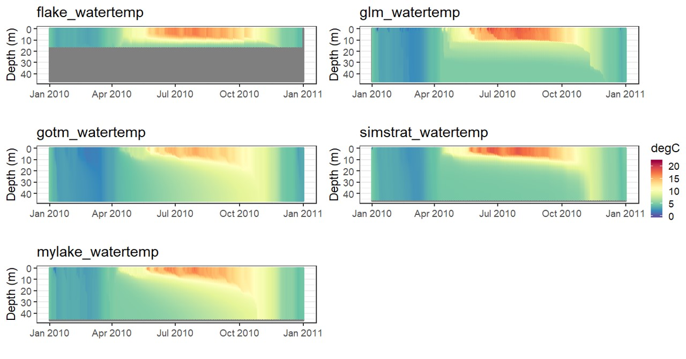

LakeEnsemblR
=====

[](https://travis-ci.org/aemon-j/LakeEnsemblR)

Tools for running an ensemble of lake models using standardised input data. Lake models currently incorporated are [Freshwater Lake Model (FLake)](http://www.flake.igb-berlin.de/), [General Lake Model (GLM)](http://aed.see.uwa.edu.au/research/models/GLM/), [General Ocean Turbulence Model (GOTM)](https://gotm.net/) (lake-branch), [Simstrat](https://www.eawag.ch/en/department/surf/projects/simstrat/), and [MyLake](https://github.com/biogeochemistry/MyLake_public).

## Installation

You can install `LakeEnsemblR` from Github with:

```{r gh-installation, eval = FALSE}
# install.packages("devtools")
devtools::install_github("aemon-j/LakeEnsemblR")
```

### Visualize

You can download [PyNcView](http://sourceforge.net/projects/pyncview/), a cross-platform NetCDF viewer, for viewing the NetCDF output.

## Example model run
```{r gh-installation, eval = FALSE}
# Install packages - Ensure all packages are up to date - parallel devlopment ongoing
#install.packages("devtools")
devtools::install_github("GLEON/GLM3r")
devtools::install_github("hdugan/glmtools")
devtools::install_github("aemon-j/FLakeR", ref = "inflow")
devtools::install_github("aemon-j/GOTMr")
devtools::install_github("aemon-j/gotmtools")
devtools::install_github("aemon-j/SimstratR")
devtools::install_github("aemon-j/LakeEnsemblR")
devtools::install_github("aemon-j/MyLakeR")

# Load libraries
library(gotmtools)
library(LakeEnsemblR)

# Copy template folder
template_folder <- system.file("extdata/feeagh", package= "LakeEnsemblR")
dir.create("example") # Create example folder
file.copy(from = template_folder, to = "example", recursive = TRUE)
setwd("example/feeagh") # Change working directory to example folder

# Set config file
config_file <- 'LakeEnsemblR.yaml'

# 1. Example - creates directories with all model setup
export_config(config_file = config_file, model = c("FLake", "GLM", "GOTM", "Simstrat", "MyLake"), folder = ".")

# 2. Create meteo driver files
export_meteo(config_file, model = c("FLake", "GLM", "GOTM", "Simstrat", "MyLake"))

# 3. Create initial conditions
export_init_cond(config_file = config_file, 
                 model = c("FLake", "GLM", "GOTM", "Simstrat", "MyLake"),
                 print = TRUE)

# 4. Run ensemble lake models
wtemp_list <- run_ensemble(config_file = config_file,
                           model = c("FLake", "GLM", "GOTM", "Simstrat", "MyLake"),
                           return_list = TRUE)

```

## Post-processing
```{r gh-installation, eval = FALSE}

# Load libraries for post-processing
library(ggpubr)
library(ggplot2)

## Plot model output using gotmtools/ggplot2

# Extract names of all the variables in netCDF
ens_out <- "output/ensemble_output.nc"
vars <- gotmtools::list_vars(ens_out)
vars # Print variables

out <- analyse_ncdf(ncdf, spin_up = 0)
names(out)
out[['strat']]
out[['stats']]

# Extract wtemp as a list
wtemp_list <- load_var(ncdf, var = 'watertemp', return = 'list')
names(wtemp_list)
deps <- rLakeAnalyzer::get.offsets(wtemp_list[[1]]) # extract depths

# Plot each 
plist <- lapply(1:length(wtemp_list), function(x){
  df <- wide2long(data = wtemp_list[[x]], deps)
  long_heatmap(df, title = names(wtemp_list)[x])+
    scale_y_reverse() + #Reverse y-axis
    coord_cartesian(ylim = c(47,0))+
    theme_classic(base_size = 20)
})

# Plot all model simulations
# install.packages("ggpubr")
g1 <- ggpubr::ggarrange(plotlist = plist, ncol = 2, nrow = 3, common.legend = TRUE, legend = 'right')
# g1
ggsave('output/model_ensemble.png', g1,  dpi = 300,width = 384,height = 280, units = 'mm')
```
<!-- -->

How do I contribute new code back to the `LakeEnsemblR` project?
==========================================================

In order to contribute to this code, we recommend the following workflow:

1.  "fork" this repository to your own personal github account

2.  clone the github repository to your computer:

    $git clone <git@github.com:{username}/LakeEnsemblR.git>

3.  modify code or add new functionality, save the code

4.  add the repository master to a remote master called "upstream"

    $cd LakeEnsemblR

    $git remote add upstream <git@github.com:aemon-j/LakeEnsemblR.git>

5.  before pushing your changes to your repository, pull in the current version of the aemon-j master:

    $git fetch upstream

6.  merge these differences with your own "master" version:

    $git merge upstream/master

7.  push your changes to your github repository, in addition to changes made by pulling in the aemon-j master:

    $git push

8.  submit a pull request to aemon-j master using your account at github.com
