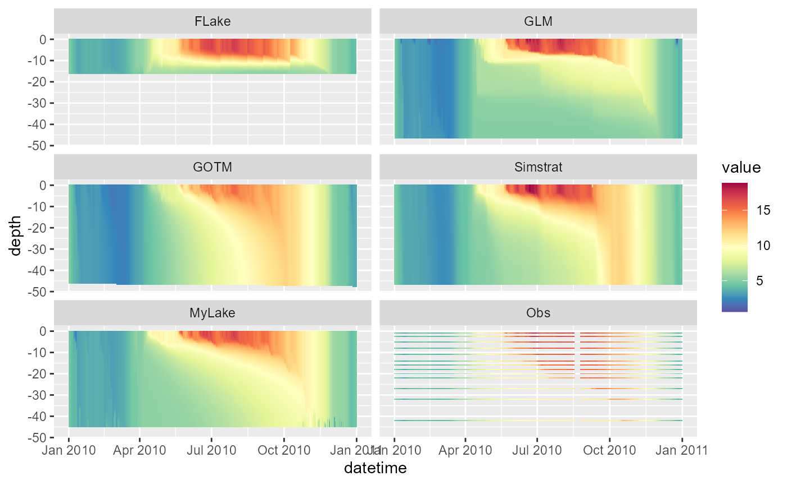
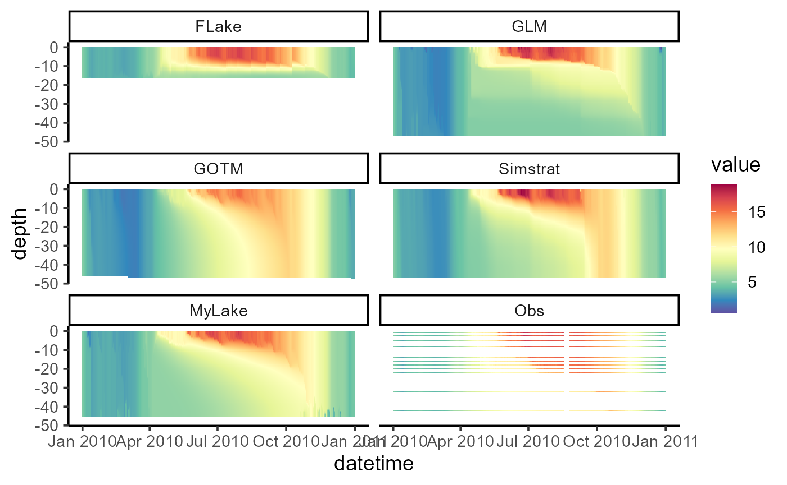

# Running LakeEnsemblR

Once you have your hypsograph, water temperature observations and
meteorological files prepared, running LakeEnsemblR is relatively
straightforward.

## Example model run

``` r

# Load LakeEnsemblR
library(LakeEnsemblR)
#> 
#> 
#>   _          _        _____                          _     _ ____  
#>  | |    __ _| | _____| ____|_ __  ___  ___ _ __ ___ | |__ | |  _ \ 
#>  | |   / _` | |/ / _ |  _| | '_ \/ __|/ _ | '_ ` _ \| '_ \| | |_) |
#>  | |__| (_| |   |  __| |___| | | \__ |  __| | | | | | |_) | |  _ < 
#>  |_____\__,_|_|\_\___|_____|_| |_|___/\___|_| |_| |_|_.__/|_|_| \_\
#>                                                                    
#> 
#>               https://github.com/aemon-j/LakeEnsemblR

# Copy template folder
template_folder <- system.file("extdata/feeagh", package= "LakeEnsemblR")
dir.create("example") # Create example folder
file.copy(from = template_folder, to = "example", recursive = TRUE)
#> [1] TRUE
setwd("example/feeagh") # Change working directory to example folder
```

``` r

# Set config file & models
config_file <- "LakeEnsemblR.yaml"
model <- c("FLake", "GLM", "GOTM", "Simstrat", "MyLake")

# Example run
# 1. Export settings - creates directories with all model setups and exports settings from the LER configuration file
export_config(config_file = config_file, model = model)
#>    depths wtemp
#> 1     0.9 4.977
#> 2     2.5 4.965
#> 3     5.0 4.953
#> 4     8.0 4.941
#> 5    11.0 4.883
#> 6    14.0 4.887
#> 7    16.0 4.877
#> 8    18.0 4.986
#> 9    20.0 4.960
#> 10   22.0 4.944
#> 11   27.0 4.980
#> 12   32.0 4.951
#> 13   42.0 4.905

# 2. Run ensemble lake models
run_ensemble(config_file = config_file, model = model)
#> [1] "Running MyLake from 01/01/10 to 01/01/11..."
#>    user  system elapsed 
#>   17.14    0.50   17.70
```

## Post-processing

``` r

# Load libraries for post-processing
library(gotmtools)
#> Loading required package: rLakeAnalyzer
library(ggplot2)

## Plot model output using gotmtools/ggplot2
# Extract names of all the variables in netCDF
ncdf <- "output/ensemble_output.nc"
vars <- gotmtools::list_vars(ncdf)
vars # Print variables
#> [1] "temp"       "ice_height" "w_level"

p1 <- plot_heatmap(ncdf)
#> Extracted temp from output/ensemble_output.nc
#>            [,1]                    
#> short_name "temp"                  
#> units      "degC"                  
#> dimensions "lon lat z model member"
p1
```



``` r
# Change the theme and increase text size for saving
p1 <- p1 +
  theme_classic(base_size = 14) + 
  scale_colour_gradientn(limits = c(0, 21),
                         colours = rev(RColorBrewer::brewer.pal(11, "Spectral")))

p1
```


